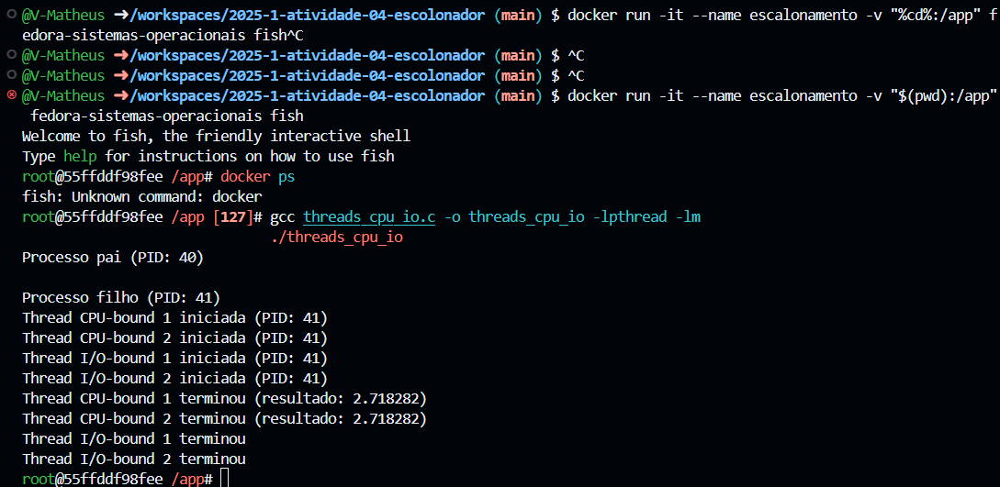
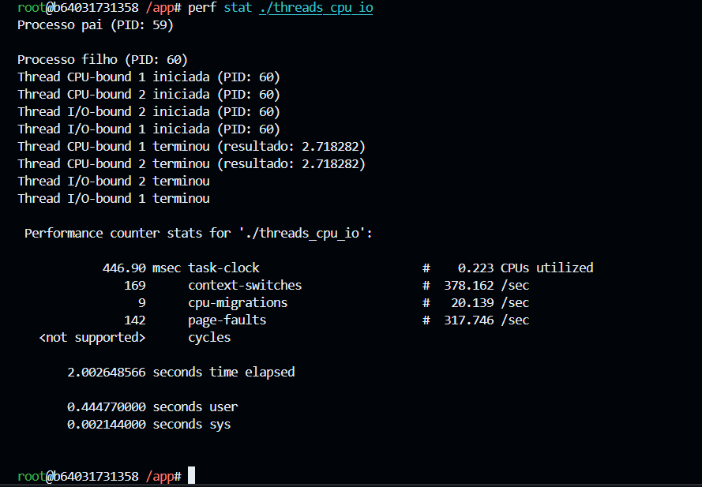

## Modificações no Programa

- Adicionei mais 1 thread de cada tipo (CPU-bound e I/O-bound).
- Alterei o cálculo da thread CPU-bound para aproximação de π usando a série de Leibniz.

---

## Análise

- O tempo total de execução não aumentou muito após adicionar mais threads, pois o cálculo é limitado pelo número de núcleos e pelo tempo de espera das threads I/O.
- O uso de CPU pelas threads CPU-bound é claramente maior, enquanto as threads I/O-bound ficam a maior parte do tempo aguardando.
- O `perf stat` mostra baixa utilização de CPU total, indicando que as threads I/O-bound não sobrecarregam o processador.

---

## Conclusão

- O escalonador do Linux prioriza threads CPU-bound quando há threads I/O-bound em espera.
- O aumento do número de threads nem sempre resulta em maior uso de CPU, especialmente quando há operações de I/O envolvidas.
- Ferramentas como `htop`, `top`, `time` e `perf` são essenciais para análise de desempenho e compreensão do comportamento de processos e threads.

---

## Imagens

### Execução do programa e compilação

### Resultado do perf stat

